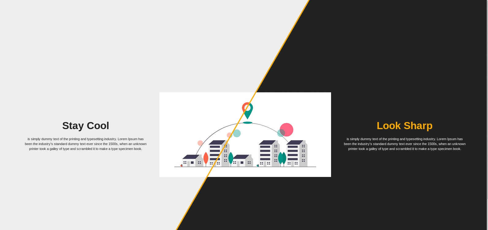

## Split Screen

It just a small project from [Brad
Traversy](https://www.youtube.com/watch?v=5F0EvajMlXo) using VanillaJS.

## Getting Started

These instruction will get you a copy of the project and running on your
local machine for development and testing purpose.

## Installing

Clone the reop

~~~
git clone https://github.com/agungTuanany/split-screen.git
~~~

Run code on your terminal

~~~
firefox index.html
~~~

~~~
enjoy
~~~

## Built With

* HTML5
* CSS3
* VanillaJS

## License

This project is opensource, you can grab and change the source under the MIT
license - see the [LICENSE.md](LICENSE.md) file for details.

## Acknowledgments
[Brad traversy](https://github.com/bradtraversy), [undraw](https://undraw.co)
